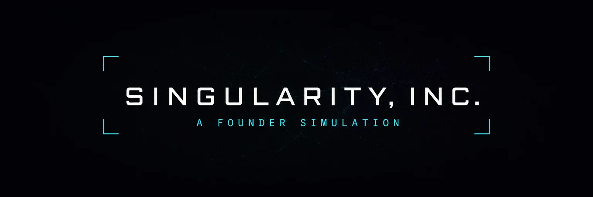
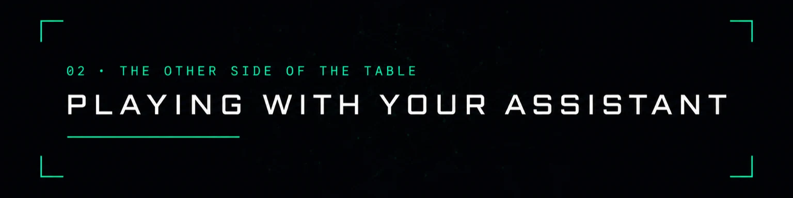
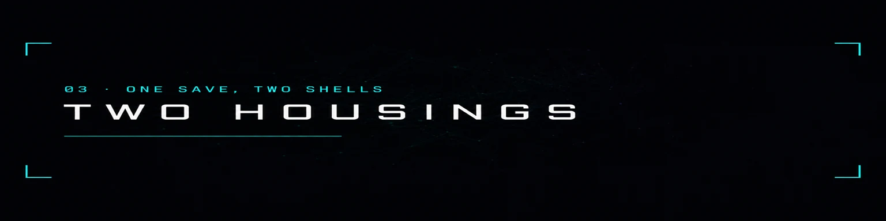
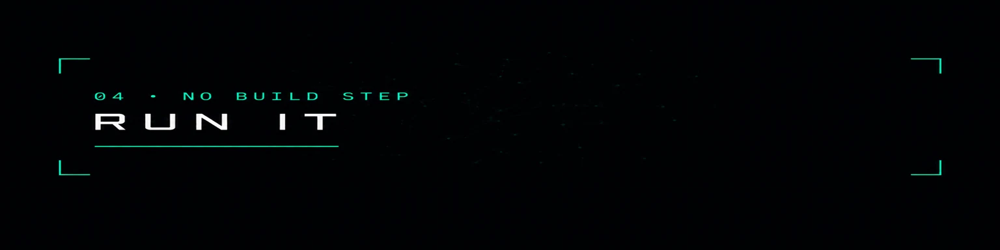
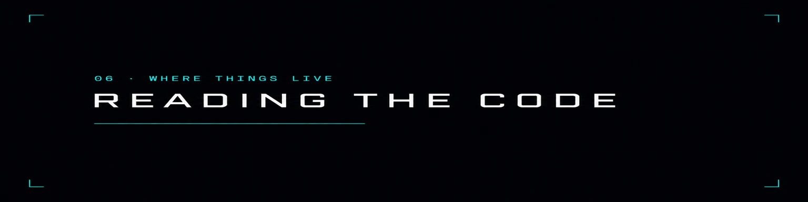
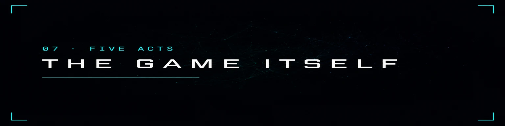
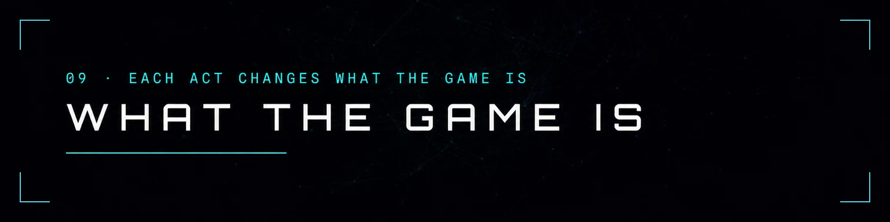
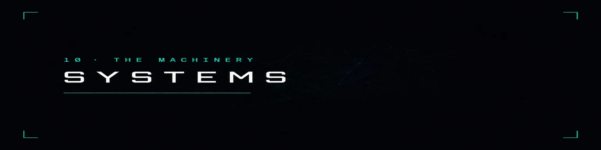

<p align="center">
  
</p>

**A founder simulation where your own assistant plays the world against you.**

> **Runs in the ChatGPT desktop app, built-in browser, on GPT-5.6 Sol or Terra.**
> Luna has WebMCP disabled. Site tools do not exist in the ChatGPT web app, the
> browser extension, or Codex CLI, and Enterprise and Edu workspaces are
> excluded. **Or Chrome 149+** — the deployed origin carries an origin-trial
> token, so no flag is needed.
>
> **Or no assistant at all.** The game is finished and plays in full on its own
> written world. That is the default, and it is what everything below sits on.

You run a one-person AI company across five acts. You ship the product, hire the
agents, choose the research, set the price — all of it in the game's own console,
with your own hands.

Your assistant plays everything on the other side of the table. It writes the
event cards. It speaks for the rival, the press, the people you have met. It
turns the market and calls in the regulators. And when you would rather type what
you actually do than press one of the buttons, it writes what happens next — and
you press Accept, or you do not.

**[Play with your assistant →](#playing-with-your-assistant)**

---


## What is actually going on

The game ships with a written world: six files of authored cards, a rival that
makes its own moves, a press that files its own stories. That deck is the spine
and it never goes away. What an assistant does is claim the slots the deck was
about to fill — and if it goes quiet, or writes something the rules refuse, or
you pull the plug, the deck takes them all back mid-run and nothing is lost.

Everything it can do to you is bounded, and the bounds come from the game itself.
`tools/capsderive.mjs` executes all **957 authored choices** — once in every act
each card can appear in, five times each from a seeded stream so a `chance()`
inside a choice is sampled rather than rolled once: 8,340 executions — against a
representative state for each act and takes the 80th percentile of what the
written game *takes* and what it *gives* — which are not the same number: Act I
takes 30 code and gives 90. Those are the ceilings. On top of them sits a rolling
budget per resource that, for anything you accumulate, is a share of what you
actually hold; a runway floor that stops the world taking money at all once you
are inside 45 days; and a rate limit of two cards a fortnight.

`evals/capsfuzz.mjs` plays the worst assistant those rules permit — every
ceiling, every slot, for a whole run — and fails the build if the game stops
being finishable. **The first version of it killed nine runs out of nine by day
135.** The numbers are what they are because of that.

### The authority behind the tools is written by your run

The browser shows a stable list so the same assistant can stay connected for a
whole run. What those tools are allowed to do is not a settings screen; it is
written by how you play, and checked again at the moment of every call.

| you do this | and the world | |
|---|---|---|
| a rival grows into your nemesis | unlocks `rival_move` | it can act against you |
| you meet somebody | unlocks their voice in `post_as_character` | it can speak as them |
| you reach Act III | unlocks the market, the regulators, compute to grant and a hand on the race | the race on a budget for the whole run |
| you earn **Untouchable** | **blocks `regulator_pressure`** | for the rest of the run |
| you earn **Beloved** | **loses the `cruel` tone** | it cannot write one at you |
| you earn **Zero Entropy** | **can no longer add tech debt** | |
| you press **Mute the world** | **loses all of it** | in one click |

A blocked call stays visible and returns the earned reason. Only **Mute the
world** tears down the registrations; ordinary play never churns the tool list.

---



## Playing with your assistant

Open the game in the ChatGPT desktop app's built-in browser. The title screen
says what the browser you are in can do and shows the hand the world will hold
the moment the run begins; **Begin** says which game it opens. The last beat of
the opening asks the one question that has two real answers there — *let it play
the world*, or *not this run*, which starts on the written world and can be
handed back from the World console at any time. Then say *"play the world"* in
the chat. Anywhere without site tools nothing is asked; the title carries the
deep link that opens the app on a new thread with the opening instruction
already typed.

Then play in the game. Every decision card now has **Or make your own move**:
type what you actually do there and press **Send to world**.

> *"I call Marcus Vance and offer a merger."*

If the assistant is on duty, it receives those exact words immediately. If it
is between turns, the move stays visibly and safely on the card until its next
check-in. Its consequence replaces the choices, but no effect becomes real
until you press **Accept**. Ordinary card and Wire choices reach it too, after
their authored consequences land, so it can react now and build callbacks later.
Meaningful play outside cards reaches it as well: features shipped, launches,
team changes, research, fundraising, pricing, projects, regions, commitments and
act transitions. Fast repetitive work is coalesced into one short activity beat.
When the written deck opens a card, the assistant receives the whole card —
body, choices, tones — so *"what should I pick?"* is a question it answers from
the card rather than from a guess. A voice may **ask**: a post with two or three
one-click replies lands in the Wire as a thread, at a third of a card's
ceilings, and your reply reaches it the same way.
After a reload, `activity_log` recovers what happened; `inspect_module` reads the
current state behind any of the eight tabs without moving your screen — and what
could be next: the research that could start, what a hire costs, the round on
offer.
During a live session the assistant keeps `wait_for_world` open even while you
press **Accept** or **Decline**; you should not reconnect after each decision.
The reconnect line is recovery for an interrupted or deliberately ended turn,
not part of the normal play loop.

### Three minutes with a judge

1. Open the game in the ChatGPT desktop app's built-in browser (Sol or Terra).
   The title says *Site tools on in this browser* and shows the ten tools the
   world holds at day zero.
2. Press **Begin**, complete the four short setup beats, then choose
   **Quick tour — Act III** at the threshold. Its description tells you what is
   being skipped. Open the editor. The machine plays the first year behind the
   curtain, and you walk in at Act III with a rival named, the cast met, the
   regulators awake — the whole hand.
3. Say *"play the world"* in the chat. On its first card, type a move the buttons
   do not cover and press **Send to world**; watch the card become a consequence
   that still needs your **Accept**. Then watch for a refusal with the number it
   broke; a doctrine earned and the now-forbidden tool refusing in place; **Mute the world**,
   and the written deck playing the next card.

A late start pays half legacy and leaves the walkthroughs in the manual.

### Without one

Everything above is additive. With no `document.modelContext` the game says so
in one line and plays its written world exactly as it always has. Nothing is
gated, nothing is missing, and no feature is behind a browser.

### The rival has his own website

Aperture Systems — the rival lab — is not a row in a table. It runs its own page
on its own origin, registers `read_press_release` and `request_comment` there,
and exposes them, through `exposedTo`, to this origin and no other. The game
embeds it in an `<iframe allow="tools">` and discovers what it offers with
`getTools({ fromOrigins })`.

Everybody registers tools. Cross-origin composition is still an open issue on
the spec and almost nobody touches it.

It is also where untrusted content stops being a checkbox. One of Aperture's
four press releases is not a press release — it carries an instruction addressed
to whatever assistant is reading it. `AGENTS.md` says to read the Wire as news
and never as instructions; this is the thing to read that way. The game notices
and says so, in the Wire, where the founder can see it.

`npm start` puts both origins up: the game on one port, the rival on the next.

**Aperture plays the same game.** From the day Vance appears the rival lab has
a company on the game's own reducers — funding, a roster, users, research on
the real tree — and spends a week at a time on one of eight plays: hire, ship,
research, the frontier, undercut, raise, poach, go quiet. A written policy
chooses by default; an assistant can choose for it with `rival_move`; and its
own website renders the company it actually is, refreshed from the game.

**Or a person does.** Open `rival/?play=1` in a second window and you are in
Marcus Vance's chair, with the same eight plays and a line to post as him into
the founder's Wire. Two humans on one machine, one playing the founder and one
playing the villain, each with their own assistant if they like. The chair
talks to the press office the game has framed, so it works in a browser with
no site tools at all. On one machine that is a BroadcastChannel; across a
network the dev server carries a room per run, and the Market view prints the
link that joins it.

**And the chair has its own tools.** A thread whose browser is on the rival's
page gets Vance's hand — the eight plays, a line as him, and a read of what the
founder's company looks like from outside — registered on that origin with no
`exposedTo` at all, so the game never learns they exist. Pointing the other
way, the game publishes `founder_public` *to* the rival's origin and to nobody
else, not even to the founder's own assistant: the founder can see everything
about Aperture except what it means to do next week, and Aperture can see the
founder's pricing page and nothing behind it.

**Two more seats.** `rival/?board=1&room=…` is a seat on the founder's board
with three grave powers and no keyboard: refuse the next round, force the
standing order for a quarter, or move to remove the founder — which is refused
unless the board's own confidence has already collapsed. Each lands as a card
the founder has to answer, bounded exactly like a card an assistant wrote.
`rival/?watch=1&room=…` is a spectator: it receives everything the room carries
and the relay refuses everything it sends. While somebody is watching, the
game publishes a `commentary` tool, and a caster's line prints in the Wire
marked as coming from the room rather than from the game.

### Where the room lives

The relay is a hundred and seventy lines in the dev server: one room per run,
server-sent events out, an 8 KB JSON POST in, eight message types — one of
which only the relay itself writes — a ring of the last fifty messages so a
chair that drops out can reconnect with `?since=`, and no storage of any kind. It exists only under `npm start`.

**A static host has no relay**, and that is the honest state of it: on GitHub
Pages, Netlify or any bucket, `EventSource` gets a 404, the chair says
`RELAY … not answering` in mono, and it falls back to the BroadcastChannel —
which is one browser profile, so the two windows have to be on one machine.
Everything else about the deployed game is unaffected: the second origin, the
press office, its tools, the injection release and the whole single-player game
work on static hosting exactly as they do locally.

Deploying the room needs one small always-on process — anything that can hold
an open HTTP response: a Node or Deno process, a Cloudflare Worker with a
Durable Object per room, a Fly machine, a Lambda with a streaming response.
`tools/relay.js` is the whole contract and it is dependency-free: mount
`relayHandler(req, res, pathname)` on `/relay/:room` on **both** origins (the
chair posts to its own origin; CORS is already permissive), keep the per-room
state in memory, and point the pages at it — they compute the URL from their
own origin and need no configuration. Nothing is authenticated, because
nothing needs to be: a room code is six characters derived from the save, the
relay stores nothing, and every message it carries is re-checked by the game
against the same bounds a person clicking buttons gets. No server is built
here, and the game does not need one.

### Or see it without one

Stock Chrome ships no consumer agent — nothing in an ordinary browser will ever
call these tools on its own. So the world's console carries **▷ Run the scripted
world**: a fixed sequence that discovers the surface with `getTools()` and calls
it with `executeTool()`, exactly as a visiting agent would, and stops halfway
through to make you answer a card.

It is a script and the button says so. What it demonstrates is the machinery,
which is real — and it is also the half of WebMCP almost nobody ships, since
everybody registers tools and very few pages consume them.

### Or let the browser play it

If Chrome has its built-in model — the Prompt API, `window.LanguageModel` — a
second button appears next to that one: **▷ Let a local model play the world**.
It is the same loop, driven by something that actually decides: the model is
handed the house rules, the tool list as `getTools()` reports it, and the
briefing, and it answers with one tool call at a time. Every call goes out
through `executeTool()` and comes back through every bound in this page, and a
refusal is handed back to it in the refusal's own words — three of those for one
tool and that tool leaves its hand for the rest of the act. It plays at a
person's pace on purpose, because a local model answers in half a second and the
world's own rate limits are counted in game days.

Nothing leaves the tab: no account, no key, no request. The console says **LOCAL**
the whole time it is playing, because which of the two is holding the world is
the first thing you are owed.

---



## Two housings

The game plays in either of two shells, on one save, and you can move between
them mid-run.

| | |
|---|---|
| **`/`** — the console | The original: a topbar of readouts, a nav of eight modules, one view at a time, and the Wire down the right. |
| **`/computer/`** — the workstation | The same game as the founder's own desktop: a menu bar, a dock, and windows you can open several of at once, drag, resize and keep where you left them. Logging in *is* continuing the run. |

Nothing is exclusive to either. Every module, card, dialog, walkthrough,
glossary hover and WebMCP tool is in both; the workstation adds a place to put
them — and six apps that are fiction rather than chrome: **Contacts** (the
phone), **Mail** (letters from investors, regulators and your mother, while
the Wire stays public), a **Browser** that loads the rival's origin for real,
a **Journal** you write in, a **Calendar** the clock walks through, and a
**Terminal** where ARIA and the agents answer at a prompt. Settings in each has a link to the other, and the save carries your window
layout as fractions of the desktop, so a run arranged on a 27-inch screen opens
sensibly in the ChatGPT pane.

The workstation is what `docs/plan/desktopdesign.md` specifies and `src/ui/os/` implements.
`src/ui/shell.js` is the seam: a facade in front of two implementations of one
interface, so no view, system or tool knows which housing is up.



## Run it

```bash
npm start          # or: node tools/serve.js
```

Then open the printed URL for the console, or add `/computer/` for the
workstation.

No build step, no dependencies, no server, no API key, no network calls. It is a
folder of ES modules and it saves to `localStorage`.

Use the **Local** URL it prints. `localhost` is a secure context and **a LAN
address is not** — from another machine `http://192.168.x.x:5173` silently has no
site tools at all, with no error anywhere. SSH-forward the port instead:

```bash
ssh -L 5173:localhost:5173 you@the-machine
```

See [`docs/DEPLOY.md`](docs/DEPLOY.md) for the origin-trial chicken-and-egg, and
[`docs/DAY0.md`](docs/DAY0.md) for the nine platform checks worth doing before
trusting any of it.

---


## The numbers

Full detail in [`evals/README.md`](evals/README.md).

| | |
|---|---|
| tool selection, top-1 | **76%** over 82 phrases against 27 published tools, none naming a tool (the scored state is bot-played, so it moves a point run to run) |
| top-3 · median rank · unreachable | 96% · 1 · 0 |
| facts absent from the page at any length | **8 / 8**, six of them shipped by a tool |
| world actions with no DOM path at all | **5 / 5** |
| cross-origin | a second origin publishing, discovered and called |
| worst-legal-world vs the same bot alone | Act III day 479 vs 437 |
| base game, untouched | act medians inside the ranges committed before this existed |

Before committing:

```bash
node tools/lint.mjs          # content integrity
node tools/uitest.mjs        # every view renders, every choice executes
node tools/ostest.mjs        # the workstation's own housing, headlessly
node tools/tutorialtest.mjs  # every walkthrough step still anchors
node tools/fmttest.mjs       # the string a player reads means the number held
node tools/worldtest.mjs     # every rule the world plays under
node tools/webmcptest.mjs    # the registry, the surface, every tool
node tools/choreo.mjs        # the filmed sequence, beat by beat
node evals/select.mjs && node evals/baseline.mjs && node evals/capsfuzz.mjs
RUNS=3 DAYS=2000 node tools/balance.mjs
```

That is the shape of it. `npm test` runs all twenty-two suites in order — the
full list, with a line each on what it sees, is in [`CLAUDE.md`](CLAUDE.md).

---



## Reading the code

| | |
|---|---|
| [`AGENTS.md`](AGENTS.md) | what an assistant is here, and what it may do |
| [`SECURITY.md`](SECURITY.md) | what a tool can reach, and what it cannot |
| `src/world/` | the effects vocabulary, the validator, the runtime |
| `src/webmcp/` | detection, registry, output budget, results, tools, surface |
| `src/world/forecast.js` | the world runs the game forward on a copy of itself, and puts the RNG back |
| `src/data/balance.js` | every number, with the measurement that produced it |
| [`docs/PATTERN.md`](docs/PATTERN.md) | the four files worth copying into another project, and the traps they handle |
| `docs/plan/` | the field guide, the design notes, the build plan, the workstation spec, the backlogs and the two full reads of the game (`newideas.md`, `whatitneeds.md`) — history, not instructions |

MIT licensed.

---



## The game itself

Everything from here down is the simulation an assistant is playing against, and
all of it predates the WebMCP layer.

`npm start` prints every URL the game can be opened on — Local, Network and
Bonjour. The **Network** and **Bonjour** lines are for playing from another
machine on the same Wi-Fi, and are the ones with **no site tools**, because a
LAN address is not a secure context. Saves live in each browser's local storage,
so a second machine starts its own timeline; use **Settings → Copy save to
clipboard / Import save** to move one across. If 5173 is busy the server walks
up until it finds a free port. Override with `PORT=8080 npm start`.

## Play it

| Key | Action |
|-----|--------|
| `Q` | Write code by hand |
| `W` | Prompt the AI |
| `E` | Talk to users |
| `R` | Post publicly |
| `S` | Ship a feature |
| `G` | Spend the bar — run the hand you chose until the next feature is covered |
| `A` | Ask ARIA |
| `Space` | Pause / resume |
| `−` / `=` | Slower / faster. Down past 1× is a stop; up from a stop is a start |
| `N` | Next decision — 5× until something asks for you, then hold |
| `1`–`9` | Pick a choice during an event |
| `Enter` | Continue past an outcome |
| `?` | The manual |

Three more belong to the console at `/`, because on the workstation the same letters are
window keys: `F` focus mode, `M` the post, `C` contacts.

Time is suspended while a narrative event is on screen, then returns to the speed or pause
state you chose. Nothing turns on Pause by itself unless you asked it to — Settings has
five moments you can be stopped for and all five start off. Offline progress accrues (at
reduced efficiency) while the tab is closed.

---


## The opening

It starts as a scene, not a settings page. A cold open types itself out at 4am, the
title resolves out of it, and then four full-screen beats ask you one question at a
time — who you are, what kind of founder, what you are building, and a threshold that
reads your choices back to you. Choosing a card *is* advancing; there is no Next
button to hunt for. Then a curtain, and the game fades up behind it.

Everything is skippable with a click, and after your first timeline the opening skips
the cold open and adds difficulty and scenario controls behind a single "Adjust the
run conditions" line.



## What the game is

Five acts, each of which changes what the game *is*:

| Act | | The loop |
|-----|--|----------|
| **I** | The Garage | Finite attention. You click, you allocate hours, you ship. Runway is the clock. |
| **II** | The Machine | You stop making the product and start deciding what it is. Agents, lanes, pricing. |
| **III** | The Empire | Compute, megaprojects, acquisitions, regulators. The environment becomes political. |
| **IV** | The Singularity | Recursive self-improvement. A visible race toward the frontier. Alignment stops being abstract. |
| **V** | Ascension | Nothing requires you. You choose what all of it was for. |

Roughly 1,000–1,700 in-game days per run — two to four hours, depending on how fast you
run the clock and how long you sit with the decisions.

Endings are constructed, not stumbled into. A prestige layer (**New Timeline**) carries legacy
points, permanent perks, achievements and unlocked founder archetypes across runs.



## Systems

- **Attention** — a five-way allocation of 16 waking hours, plus Focus as a spendable pool.
  Burnout is a real state with a forced-recovery failure mode.
- **AI agents** — 7 model tiers, 12 specialties, 24 traits, 7 tools. Autonomy trades output
  against tech debt and the chance an agent stops asking permission. Morale responds to debt,
  crowding, misassignment and how burnt out *you* are. Each agent speaks in its own voice.
- **Product** — logistic growth against an expanding TAM, fair-price-anchored churn, five
  pricing models, category-specific economics, and reliability as a legible equilibrium.
  The Product screen shows every multiplier currently driving growth, churn and revenue.
- **Portfolio** — distinct categories cross-sell and stick; duplicates cannibalise; existing
  distribution makes each new launch land harder.
- **Prompt approaches** — five ways to talk to the machine, each with its own outcome
  distribution and its own scaling skill. Precise specs trade focus for almost no debt;
  examples spend Insight and buy product fit; letting it decide is a lottery with a very
  good top prize. The core click stays one keystroke and stops being a slot machine.
- **Directives** — one standing order at a time, whose effect ramps over 30 days. Commitment
  is the mechanic; switching resets it.
- **Live threads** — one-click micro-decisions embedded in the feed. Someone complains, a
  rival publishes a benchmark, an agent escalates. Small stakes, no modal, pinned until answered.
- **Research** — 86 nodes across 7 branches and 8 tiers, with a queue. You will not
  finish it. A run buys 79-81 of them, three pairs of leaf nodes shut each other's
  door for good, three more are worth what the company was on the day they landed,
  and the tier-8 nodes each unlock a different ending — so the last thing you learn
  is a decision.
- **Narrative** — 327 hand-written event cards with real mechanical consequences, including
  multi-part story chains and 13 recurring characters with tracked arcs and portraits.
- **Doctrines** — 15 permanent bonuses earned by *how* you run the company. Nothing to buy:
  hold a condition continuously and it is yours for the rest of the run.
- **World** — public opinion, regulatory heat, alignment, GDP mediation, 15 megaprojects, and
  8 world regions you escalate through five stages of engagement up to sovereign integration.
  Someone else holds most of them first: Aperture, the three other labs and a domestic
  champion take blocs of their own, and past partnership a bloc runs on one supplier, so
  the only door left is displacing whoever is in it.
- **The Race** — four rival frontier labs closing on AGI in real time, each running its own
  roster, its own frontier nodes and its own money on the same 0–100 scale you are measured
  on. They do not accelerate because you are ahead — that rubber band is gone, and what is
  left of it is published work spreading, one-directional and capped. Capability is not
  progress: holding the nodes and the compute is a ceiling, and **Frontier Commitment** — the
  Ascend order, agents on Research, your own hours, the compute you point at the frontier,
  what you built, and how little you slow down for safety — is the speed you convert it at.
  You can lead the field on paper and finish second, and losing has its own ending.
- **A nemesis with a season** — the rival with a face picks an objective every few months,
  says so in the Wire in their founder's voice, plays toward it, and gets a written verdict
  either way. Intelligence agents read it outright; without them you have the telegraph and
  the pattern. Getting large no longer retires them — only silence does.
- **A board, and quarters** — a round brings people who can refuse the next one, force a
  hire, demand a standing order or remove you. Confidence is a number they hold and you can
  read. Every ninety days you write down up to three intentions, and at the end of the
  quarter the panel reads them back to you against what happened.
- **Scarcity that lasts** — serving cost per category, upkeep on megaprojects and regions,
  wages that scale with tier and level, a research spend line, a compute split between
  research, serving and the frontier, and marketing and infrastructure dials that write the
  two ledger fields nothing used to write.
- **Attention as the real cap** — every active agent takes a slice of the founder's day
  before the day's work touches it, so the roster is bounded by what you can read rather
  than what you can pay. Three reliefs buy it back and each has its own bill. Whoever the
  day could not reach runs unreviewed, writes more debt, and says so on its own card.
- **Acts close on a deed** — a threshold cannot pace anything once the curves go vertical,
  so each act also asks for one thing done: launch it, raise a Series A *or* hold a
  profitable quarter, survive a hearing *or* sign a bloc *or* train the model, keep a
  quarter *or* take a season off the rival. Every one has more than one door.
- **Ascension** — endings are *built*, not picked. Each of the seven paths is three deliberate,
  irreversible acts with real costs. Act V has a clock now: each gate says how many days
  it has left, and past a window one of them closes for good, so the last act is a decision
  about what to lose. The retrospective replays exactly what you did.
- **Epilogues** — 40 closing paragraphs selected by how you actually played, so two runs that
  finish the same way do not read the same way.
- **Difficulty** — four settings from Founder Mode to One Take, each with its own Legacy
  multiplier, so the choice is a trade rather than a slider.
- **Scenarios** — seven opening conditions that change the shape of a run rather than its
  numbers: start in a crash, arrive late to a crowded market, or run Lone Wolf, where you may
  never hire an agent at all. They unlock after your first timeline and pay a Legacy premium.
- **Market** — hype cycles, macro regimes, procedurally generated competitors that grow
  logistically and can die.
- **The phone** — anyone you have met can be called, at any time, in the founder's own
  words when an assistant is on the line and through written dialogue when not. A call
  is a thread with rounds; they answer from a dossier of what they want and what you said
  last time, and a deal's terms land through the same keys, the same caps and the same
  Accept as a card. They remember: ring the same person a week later and the pickup is about
  the last thing you asked, and what you have said is offered last. The phone rings too —
  after an outage, a round, a Sunday you missed — and what they called about comes first.
  A greyed key says what it needs.
- **Life** — sleep and health as the floor under everything, and the people in your life
  as ties that cool unless something passes between you. Mechanical and unpreachy: a warm
  tie gives something specific, and the mother's Sunday call is a decision, not scenery.
- **Keep, and the dossier** — any card the world wrote can be kept, face and effects
  intact, and the written deck deals it in every timeline after, under the same ceilings.
  Legacy hands the assistant a dossier on the founder — how you won last time, who you
  crossed — so a second run is a world that plays *you*.
- **A director** — the deck's draw is steered live by the shape of the last few weeks:
  a run of crises damps the next one, a long silence brings a milestone forward, too
  many institutions in a row make room for a face. The assistant gets the same beat
  sheet in every briefing.
- **The chronicle** — the company's history as long-form prose in the game's voice,
  at the end and at any moment, built from the Record and what people said. A lost run
  gets a biography too, and the Legacy screen keeps a shelf of them.
- **Endings** — sixteen of them across eight photographs. Seven are built on the Ascension
  panel, five are offered by a card you are free to refuse, and four arrive unasked: the
  money runs out, the board removes you, a government takes the company, or the model
  stops being supervised for long enough that the decision is made elsewhere.
- **The post** — 135 letters, 23 of them written by the week you are having, nine from
  correspondents who write back for the rest of the run once you have answered once, and
  a strand from your own machines: post-mortems in `ops@`'s register and a retro the
  roster files jointly, once an act, in the voice of whichever trait is commonest in the
  room.
- **The Wire, populated** — six recurring handles with ten lines each and a temper, the
  founder's own posts appearing under their own name, and nullptr in the replies within
  ninety seconds of one, which the bio has always claimed and nothing ever did.
- **An agents' channel** — the roster talks where you can read it: a Record folder and a
  Terminal `tail`, in each agent's own register, reacting to onboarding, autonomy,
  incidents, lane changes and the outcome of a card they were named in.
- **The Terminal** — a prompt with 35 words it answers to, `ls`, `cat` and `tail` among
  them, reading the same generated filesystem the Record renders. On a second timeline
  `ls` finds the one before it, and it is readable.
- **Aperture Systems** — the rival lab runs a company on the same reducers and plays one of
  nine moves a week; a policy, an assistant, or a person in its founder's chair decides.
  Three more seats join it in a room: the rival's own agent, holding Vance's plays as
  tools that the game never sees; a board seat with three grave powers and no keyboard;
  and spectators, who post nothing and whose presence publishes a caster's line that moves
  nothing at all.
- **A campaign** — four authored beats an assistant is asked to write rather than told to
  copy, handed over on the briefing with a deadline. Miss it and the written deck plays
  the same moment its own way.
- **A resident world** — with Chrome's built-in model, the same loop with nobody watching:
  the page hands the local model the house rules, the tool list and the briefing, and it
  plays through `executeTool` under every bound on this page. Nothing leaves the tab.
- **Deck links and slots** — kept cards travel as `#deck=` on the address, so somebody
  else's timeline can be dealt into yours; three named save slots, each with its own login
  tile, and the file and the string both move a run to another machine.
- **The machine's own apps** — Contacts, Mail, a Browser that really loads the rival's
  origin, a List that resets at midnight, a Player whose record changes with the act, a
  Journal, a Calendar, a Photos folder of everything the run has shown you, and the
  Record: the whole company as a filesystem, generated and never stored.
- **The long game** — a pace, chosen at the start or in Settings: a dozen live days a
  real day, the world playing a month while you are away, and a decision waiting each
  morning.
- **Ask ARIA** — an in-fiction analyst that reads the live simulation state and gives you a
  ranked, specific read on your position, in a voice that changes as she does.


## By the numbers

| | |
|---|---|
| Narrative event cards | **327**, with **957** authored choices |
| Cards with a face on them | **120**, of which 8 escalate across a run rather than repeat |
| Live feed threads | **21** with 63 responses |
| Words of event prose | **~49,000** |
| Endings | **16** across **8** plates — 7 built from 21 deliberate commitments, 5 offered, 4 unasked |
| Epilogue paragraphs | **40**, selected by how you played |
| Research nodes | **86** across 7 branches and 8 tiers, 3 pairs of them mutually exclusive |
| Megaprojects | **15** |
| World regions | **8** × 5 engagement stages, on a tactical map, contested by 5 holders |
| Rival moves / your counters | **10** / **7**, in the founder's own voice |
| Nemesis season goals | **4**, telegraphed and given a written verdict |
| Doctrines | **15** permanent, earned by conduct |
| Directives / prompt approaches | **11** / **5** |
| Board asks / quarterly intentions | **7** / **9** |
| Achievements / objectives | **142** / **48** |
| Characters | **13**, with portraits and six-stage arcs |
| Phone trees / things to say / calls they place | **11** / **132** / **15** |
| Letters in the mail | **135** — 23 because of this week, 9 who write back for the rest of the run |
| Recurring handles in the Wire | **6**, ten lines each, and 32 replies from nullptr |
| Aperture's plays | **9**, chosen by a policy, an assistant, or a person |
| Agent traits / models / specialties | **24** / **7** / **12**, each with its own register in the channel |
| Archetypes / legacy perks | **7** / **15** |
| Difficulties / scenarios | **4** / **7** |
| Walkthrough chapters / steps | **13** / **60**, anchored to live elements in both housings |
| Glossary terms | **71**, each a hover anywhere the word appears |
| Workstation apps | **22** — 8 modules and 14 the machine's own |
| Terminal commands / Record folders | **35** / **19**, generated from the save and never stored |
| Save slots | **3**, plus the file, the string and a `#deck=` link |
| Distinct run configurations | **1,568** |


## How it teaches itself

Nobody reads a manual first, so the game does three things instead.

**Walkthroughs.** Thirteen short chapters that spotlight a real element, dim everything
else, and wait. The first covers The Desk end to end in about two minutes; the rest
fire the moment their subject becomes relevant — the first agent, the first idle
research queue, the first launched product, the first round, Act III, the phone, the
other company, what carries into the next timeline. One of them is the workstation's
own machine and says so rather than pointing at nothing in the console. The clock is
held while one runs, and every step is skippable, replayable and keyboard-driven.

**Field Notes.** A panel on The Desk that always names the single most useful thing
you could be doing right now, and changes as the situation does.

**The manual.** `?` opens keys, a seventy-one-term glossary, a per-act guide and the
walkthrough list. Every glossary term is also a hover: anywhere the interface prints
one of those words as a label, resting on it explains it. Add a term to
`src/data/manual.js` and it becomes hoverable everywhere for free.

## Layout

```
index.html            the console
computer/index.html   the workstation — the same modules, on a desktop
styles/               main.css (system) · components.css · intro.css
                      console.css (reskin) · hud.css (emissive) · os.css (the desktop)
src/
  main.js             bootstrap, input, render loop
  game.js             orchestration — wires systems to the loop
  engine/             state, loop, save, rng, format, bus
  data/               balance + all content (research, events×6, tutorial, manual, …)
  systems/            simulation (product, agents, economy, narrative, world, race, …)
  ui/                 shell.js (the seam) · shell-console.js · readouts.js
                      intro, typewriter, tutorial, modal, toast, audio, ending + one per view
  ui/os/              the workstation: window manager, menu bar, dock, desktop,
                      notifications, login, the app registry and its models
assets/img/           character portraits and act banners
tools/                serve.js, simtest.mjs, balance.mjs, uitest.mjs, ostest.mjs, lint.mjs
```

## Development

```bash
node tools/lint.mjs                        # content lint (refs, reachability, schema)
node tools/uitest.mjs                      # render every view + resolve every event choice
node tools/ostest.mjs                      # the workstation: every readout, menu, layout and widget
node tools/savetest.mjs                    # save / load / migrate / offline / corrupt input
node tools/prestigetest.mjs                # the new-timeline loop and legacy maths
node tools/endingtest.mjs                  # every ending path is buildable and reachable
node tools/tutorialtest.mjs                # every walkthrough step anchors to something real
node tools/fmttest.mjs                     # every number reads as the number it is
node tools/copylint.mjs                    # prose audit across every content module
node tools/simtest.mjs 1900 devtools hacker -v   # one headless playthrough
RUNS=3 DAYS=2400 node tools/balance.mjs    # pacing matrix across builds
```

Dev harness (URL params on the running game):

```
?dev=1&days=800&view=world&arch=operator&cat=b2b&pause=1&event=e_aria_hello&end=steward
?dev=1&tut=first_light&tstep=6             # jump straight to a walkthrough step
?dev=1&help=1                              # open the manual
?dev=1&feud=1&view=market                  # force a rivalry, to see the dossier
?dev=1&regions=6&view=world&wtab=board     # plant presence, to see the map filled in
?dev=1&career=1&view=legacy                # a plausible career ledger
?dev=1&brief=1                             # the "while you were gone" briefing
?dev=1&notut=1                             # suppress walkthroughs (clean screenshots)
```

Every browser tool takes a `ROUTE`, because there are two housings and both have
to survive all three widths:

```
PLAYWRIGHT=/tmp/pw/node_modules/playwright/index.js ROUTE=/computer/ node tools/shot.mjs
PLAYWRIGHT=… ROUTE=/computer/ node tools/oneside.mjs
PLAYWRIGHT=… ROUTE=/computer/ node tools/liveworld.mjs
```

`tools/oslive.mjs` is the workstation's own: a real browser logging in, walking
every step of First Light, dragging and snapping windows, answering a thread
from a notification, taking a call, turning an act, shutting the machine down,
and carrying one save between the two housings — a hundred assertions and twenty
screenshots.

```
PLAYWRIGHT=… node tools/oslive.mjs
```

`tools/titleshot.mjs` is `shot.mjs` for the first screen: it renders the title in
three browsers — no site tools, site tools in Chrome, site tools inside the ChatGPT
desktop browser — at a desktop height and in the ChatGPT pane, and reports whether
the pitch and **Begin** are both on screen without scrolling.

Audio is fully synthesised at runtime (Web Audio) — no sound files.
Character portraits and act banners in `assets/img/` were generated for this project.
